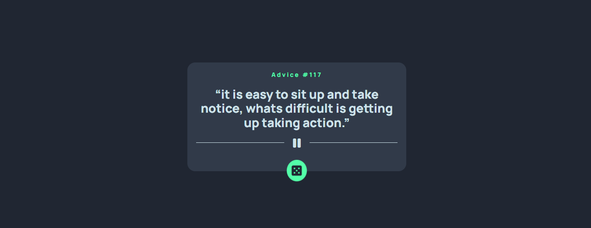
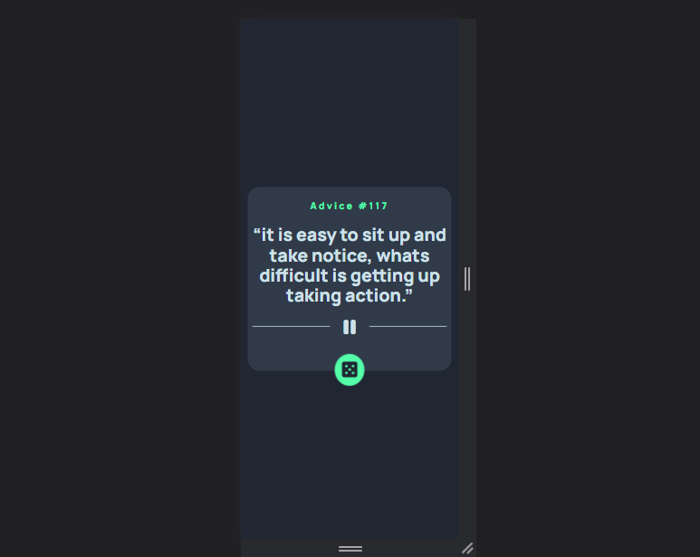

# Frontend Mentor - Advice generator app

This is a solution to the [Advice generator app challenge on Frontend Mentor](https://www.frontendmentor.io/challenges/advice-generator-app-QdUG-13db). Frontend Mentor challenges help you improve your coding skills by building realistic projects.

## Table of contents

- [Overview](#Overview)
- [The challenge](#The-challenge)
- [Screenshot](#Screenshot)
- [Links](#Links)
- [My process](#My-process)
- [Built with](#Built-with)
- [Author](#Author)
- [Acknowledgments](#Acknowledgments)

## Overview

### The challenge

Users should be able to:

- View the optimal layout for the app depending on their device's screen size
- See hover states for all interactive elements on the page
- Generate a new piece of advice by clicking the dice icon

### Screenshot

### Links

- Live Site URL: https://ali-el-shoraa.github.io/advice-generator-app-main/

## My process

### Built with

- HTML
- CSS
 - Flexbox
 - Animation
- Fontawesome - icon library
- Normalize - CSS library
- JavaScript
 - AJAX
 - DOM

## Author

- Github - [Ali-El-Shoraa](https://github.com/Ali-El-Shoraa)
- Frontend Mentor - [@Ali-El-Shoraa](https://www.frontendmentor.io/profile/Ali-El-Shoraa)
- Codepen - [@Ali_El-Shoraa](https://codepen.io/Ali_El-Shoraa)

## Acknowledgments

Many thanks to anyone who provided feedback
